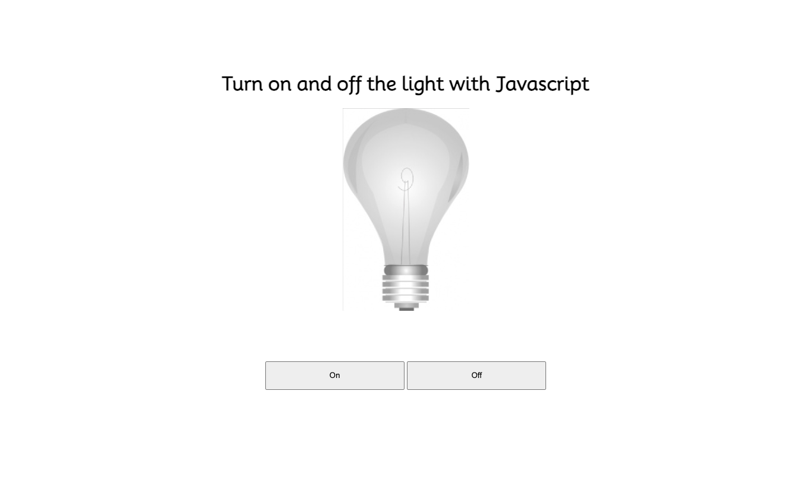

# javascript-lightbulb

## Mål:
- Forstå grundlæggende JavaScript-funktioner.
- Interaktion med HTML-elementer ved hjælp af JavaScript.

## Instruktioner:

1. **Åbn HTML-filen:**
   - Åbn din HTML-fil i en teksteditor eller et udviklingsmiljø som Visual Studio Code.

2. **Tilføj Billede og Knapper:**


3. - Find  ```<h1>``` elementet, indsæt efterfølgende dette kdoeafsnit:
    ```html
   
   ```

4. - Find ```<section>```elementet, og indsæt imellem dette kodeafsnit:

   ```html
   <button onclick="onBulb()">On</button>
   <button onclick="offBulb()">Off</button>
    ```
5. **Demo af hjemmesiden**


6. **Åbn JavaScript-filen:**
   - Åbn javascript filen "script.js" i mappen 'js' med din teksteditor for at begynde at skrive JavaScript-koden. 

7. **Tilføj Følgende JavaScript-kode i "script.js":**
```javascript
function onBulb() {
  const bulb = document.getElementById("bulb");
  bulb.src = "img/on.jpg";
}

function offBulb() {
  const bulb = document.getElementById("bulb");
  bulb.src = "img/off.jpg";
}
```

8. **Test din lightbulb:**
    - Åbn HTML-filen i din browser eller via Live server i VS Code.
    - Klik på "Tænd" og "Sluk" for at se, hvordan billedet af lyspæren ændrer sig.
